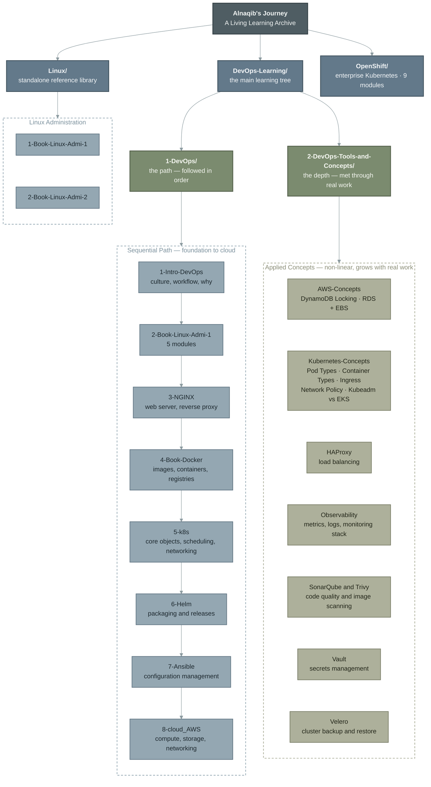
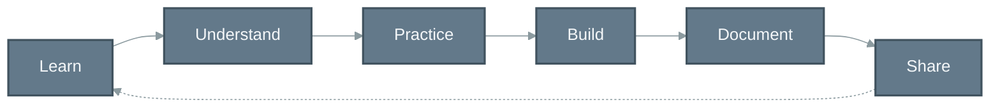

# Alnaqib's Journey

**A Living Learning Archive — DevOps, Linux, Kubernetes and Cloud**

This repository is the working archive of an ongoing learning journey. Every folder here
represents something that was actually read, practiced, broken, fixed and written down —
not a curriculum designed in advance.

It is intentionally unfinished. New tools and topics are added as they are encountered in
real work, which means the structure grows over time rather than being frozen at a
"final" version.

---

## What this repository is

- A **structured archive** of study material, notes and references collected while learning DevOps.
- A record of the **order** things were learned in, so the path itself is visible — not just the end result.
- A place where each tool has its own space, including the small ones that only came up once in a real problem.

## What this repository is not

- Not a course, tutorial series, or teaching product.
- Not a portfolio of finished projects — hands-on project repositories live separately.
- Not a claim of mastery over anything listed here.

---

## Learning Architecture

The diagram below is a **knowledge map**, not an application architecture. It mirrors the
real folder tree of the repository: three top-level domains, and inside the main one, two
different kinds of learning — a sequential path, and a non-linear set of concepts that grew
out of real work.



### Reading the diagram

| Layer | Meaning |
|---|---|
| Root | The archive itself — one repository, one continuous journey. |
| Domains | The three top-level directories at repository root. |
| Tracks | Inside `DevOps-Learning/`: the ordered path, and the applied-concepts collection. |
| Nodes | Actual folders on disk. Nothing here is aspirational or planned-only. |

The two tracks exist for a reason. `1-DevOps/` is **linear** — each folder builds on the one
before it, and the numbering is the study order. `2-DevOps-Tools-and-Concepts/` is
**non-linear** — those folders appeared because a specific tool or behaviour showed up
while working on something real, and it needed to be understood properly before moving on.

---

## Repository structure

```
Alnaqib-s-Journey/
│
├── DevOps-Learning/
│   │
│   ├── 1-DevOps/                        # the ordered path
│   │   ├── 1-Intro-DevOps/
│   │   ├── 2-Book-Linux-Admi-1/         # 5 modules
│   │   ├── 3-NGINX/
│   │   ├── 4-Book-Docker/
│   │   ├── 5-k8s/
│   │   ├── 6-Helm/
│   │   ├── 7-Ansible/
│   │   └── 8-cloud_AWS/
│   │
│   └── 2-DevOps-Tools-and-Concepts/     # tools met through real work
│       ├── AWS-Concepts/
│       │   ├── DynamoDB-Locking/
│       │   └── RDS+EBS/
│       ├── HAProxy/
│       ├── Kubernetes-Concepts/
│       │   ├── Container-Types/
│       │   ├── Ingress/
│       │   ├── Kubeadm-vs-EKS/
│       │   ├── Network-Policy/
│       │   └── Pod-Types/
│       ├── Observability/
│       ├── SonarQube&Trivy/
│       ├── Vault/
│       └── Velero/
│
├── Linux/                               # standalone reference library
│   ├── 1-Book-Linux-Admi-1/
│   └── 2-Book-Linux-Admi-2/
│
└── OpenShift/                           # 9 sequential modules
```

**Current size:** 41 directories, 61 files.

---

## Working method

Every topic in this archive went through the same loop. Nothing gets a folder here until it
has at least been practiced — and the dotted line back means the loop never actually closes.



- **Learn / Understand** — read the source material properly instead of collecting commands.
- **Practice** — run it, break it, read the errors.
- **Build** — use it inside something real, not an isolated example.
- **Document** — write it down here, in a form that is still useful months later.
- **Share** — keep the repository public so the path is reviewable.

---

## Conventions

A few deliberate decisions worth knowing before browsing or cloning:

- **Numbering is the study order.** `1-`, `2-`, `3-` prefixes are not cosmetic. Folders are
  read in that sequence.
- **Filenames are normalized.** All spaces replaced with hyphens, no trailing spaces before
  extensions — so paths are safe to use in scripts and CI.
- **Linux Book 1 appears twice, on purpose.** Once inside `DevOps-Learning/1-DevOps/` to keep
  the learning path complete, and once under `Linux/` so the reference library stands on its
  own. This is not a duplication mistake.
- **Scanned material is compressed.** The archive was reduced from roughly 688 MB to about
  114 MB in the working tree, so a clone stays reasonable.
- **History is intentionally a single commit.** Older revisions carried the uncompressed
  files and were rewritten out; keeping them would have kept the repository heavy forever.
- **Oversized files are blocked at commit time** by a pre-commit hook, so the size problem
  does not come back.

---

## How to use this repository

Clone it and read a track end to end rather than jumping between folders:

```bash
git clone https://github.com/yousefsalemW/Alnaqib-s-Journey.git
cd Alnaqib-s-Journey
```

- New to DevOps → start at `DevOps-Learning/1-DevOps/1-Intro-DevOps/` and follow the numbers.
- Looking for one specific tool → go straight to `DevOps-Learning/2-DevOps-Tools-and-Concepts/`.
- Working on Linux fundamentals → `Linux/`.
- Coming from a Kubernetes background → `OpenShift/`.

---

## About

**Yousef Salem** — Junior DevOps Engineer, Cairo.

I keep this archive public because the intermediate steps of learning are usually the part
that gets deleted, and they are the part worth keeping. It grows as I do.

- GitHub: [yousefsalemW](https://github.com/yousefsalemW)
- Docker Hub: [alnaqib](https://hub.docker.com/u/alnaqib)
- LinkedIn: [yousef-salem-1a5757401](https://www.linkedin.com/in/yousef-salem-1a5757401)

---

## Note on content

This archive contains study material and personal notes gathered from books, official
documentation and hands-on practice. Third-party material remains the property of its
original authors and is kept here for personal study and reference. The notes, structure and
documentation are my own work.
