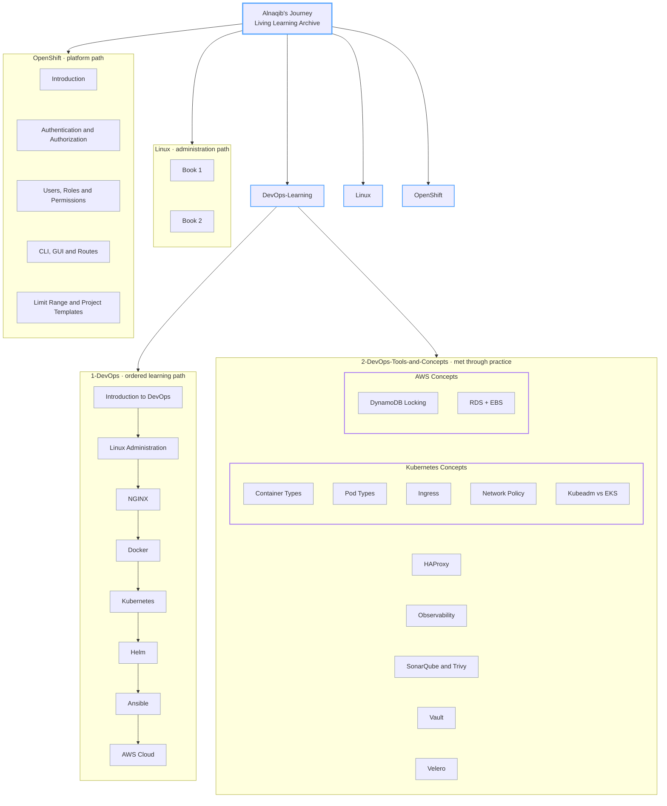

<div align="center">

# Alnaqib's Journey

### A Living Learning Archive


</div>

---

## Introduction

This repository is my learning archive. Not a course, not a portfolio, and not a folder of leftover notes — it is the written record of how I am learning DevOps, one topic at a time, and what I actually understood along the way.

I created it because reading is not the same as knowing, and knowing is not the same as being able to explain. Every time I study a subject, break something in a lab, hit an error I did not expect, or finally understand why a tool behaves the way it does, I write it down here. The act of documenting is what turns scattered reading into knowledge I can come back to six months later and still trust.

Inside, you will find structured study material and notes across DevOps fundamentals, Linux administration, NGINX, Docker, Kubernetes, Helm, Ansible, AWS, OpenShift, plus the tools and concepts I met through real project work — Vault, Velero, HAProxy, SonarQube, Trivy, observability, Kubernetes networking, and AWS services. The organization follows how I learned: a main path I work through in order, and a second area for the things practice forced me to learn out of order.

The journey is still in progress, and it is meant to stay that way. New technologies, new concepts, new mistakes, and deeper passes over topics I have already touched will keep being added. This archive is intentionally never finished.

---

## Learning Philosophy

```text
Learn  →  Understand  →  Practice  →  Build  →  Document  →  Share  →  Keep Learning
```

| Stage | What it means here |
| :-- | :-- |
| **Learn** | Read the book, the docs, the course material. Cover the topic properly, not partially. |
| **Understand** | Rebuild the idea in my own words. If I cannot explain it simply, I have not understood it. |
| **Practice** | Run it. Break it. Read the error. Fix it. Labs and clusters over screenshots. |
| **Build** | Use the tool inside something real, where the trade-offs actually show up. |
| **Document** | Write it into this repository, in a form my future self can reuse. |
| **Share** | Keep it public, so the notes are useful to someone other than me. |
| **Keep Learning** | Return to the topic later, deeper, and correct what I got wrong. |

This repository is the **Document** and **Share** part of that cycle — which is why it grows every time the earlier stages happen.

---

## Learning Architecture

A knowledge map of how the learning paths are organized and how they relate. The `1-DevOps` path is sequential by design; everything in `2-DevOps-Tools-and-Concepts` was picked up independently, driven by practice.



---

## Repository Map

The repository has three top-level areas: `DevOps-Learning/`, `Linux/`, and `OpenShift/`.

### `DevOps-Learning/1-DevOps/` — The main learning path

The primary, ordered progression I am working through. It starts with what DevOps actually is, then moves into Linux administration as the foundation, then upward through the stack: NGINX as the web and proxy layer, Docker for containers, Kubernetes for orchestration, Helm for packaging Kubernetes workloads, Ansible for configuration management and automation, and AWS for cloud infrastructure.

The numbering is deliberate. Each folder assumes the ones before it, and the Linux section is subdivided the way the material is actually taught — files and directories, users and groups, privileges and permissions, process and software management, networking, SSH, and shell scripting.

### `DevOps-Learning/2-DevOps-Tools-and-Concepts/` — Tools and concepts from practice

This is a deliberate second track, not an overflow folder. Real work does not follow a syllabus: a project needs secret management, a cluster needs backups, a pipeline needs a quality gate and an image scan, a load balancer misbehaves, or a concept turns out to be deeper than the course covered.

Everything here came from that direction — encountered in practice, then studied properly and written up:

- **Vault** — secret management
- **Velero** — cluster backup and restore
- **HAProxy** — load balancing and high availability
- **SonarQube & Trivy** — code quality and vulnerability scanning
- **Observability** — monitoring and visibility into running systems
- **Kubernetes Concepts** — container types, pod types, Ingress, network policies, and Kubeadm compared to EKS
- **AWS Concepts** — DynamoDB state locking, RDS and EBS

The split between this section and `1-DevOps/` is intentional and worth preserving: one is the curriculum, the other is the field notes.

### `Linux/` — Dedicated Linux administration path

A separate, deeper Linux track following two administration books end to end. Linux appears in the main DevOps path as a foundation; here it is the subject itself, studied in its own right, because most DevOps problems turn out to be Linux problems.

### `OpenShift/` — Dedicated OpenShift path

A self-contained platform track covering OpenShift from introduction and installation through authentication and authorization, user creation, permissions and roles, CLI and web console usage, routes, limit ranges, and project templates.

---

## Repository Structure

```text
Alnaqib-s-Journey/
├── DevOps-Learning/
│   ├── 1-DevOps/
│   │   ├── 1-Intro-DevOps/
│   │   │   └── DevOps_Intro.pdf
│   │   ├── 2-Book-Linux-Admi-1/
│   │   │   ├── 1-Basics&Managing-Files&Directory&Users&Groups&User&Help/
│   │   │   ├── 2-Privilege&Permission&Management-Process-S.W/
│   │   │   ├── 3-Network/
│   │   │   ├── 4-ssh/
│   │   │   └── 5-Scripts/
│   │   ├── 3-NGINX/
│   │   ├── 4-Book-Docker/
│   │   ├── 5-k8s/
│   │   ├── 6-Helm/
│   │   ├── 7-Ansible/
│   │   └── 8-cloud_AWS/
│   │
│   └── 2-DevOps-Tools-and-Concepts/
│       ├── AWS-Concepts/
│       │   ├── DynamoDB-Locking/
│       │   └── RDS+EBS/
│       ├── HAProxy/
│       ├── Kubernetes-Concepts/
│       │   ├── Container-Types/
│       │   ├── Ingress/
│       │   ├── Kubeadm-vs-EKS/
│       │   ├── Network-Policy/
│       │   └── Pod-Types/
│       ├── Observability/
│       ├── SonarQube&Trivy/
│       ├── Vault/
│       └── Velero/
│
├── Linux/
│   ├── 1-Book-Linux-Admi-1/
│   └── 2-Book-Linux-Admin-2/
│
└── OpenShift/
    ├── 1-Intro-OpenShift.pdf
    ├── 2-OpenShift-authentication&authorization.pdf
    ├── 3-OpenShift-Install.pdf
    ├── 4-OpenShift-Permission&Role.pdf
    ├── 5-OpenShift-Create-Users.pdf
    ├── 6-OpenShift-CLI-&-GUI.pdf
    ├── 7-OpneShift-Rout.pdf
    ├── 8-OpenShift-Limit_Range.pdf
    └── 9-OpenShift-Project_Template.pdf
```

New folders and files are added as the journey continues, so this tree is a snapshot rather than a final layout.

---

## Topics & Technologies

Listed with an honest description of how far each one has been taken in this archive. Nothing here is a claim of mastery. All paths are relative to the repository root.

### Operating Systems & Web Layer

| Technology | Where | Level of engagement |
| :-- | :-- | :-- |
| **Linux** | `Linux/` · `DevOps-Learning/1-DevOps/2-Book-Linux-Admi-1/` | Studied across two administration books and documented: files and directories, users and groups, permissions and privileges, process and software management, networking, SSH, shell scripting |
| **NGINX** | `DevOps-Learning/1-DevOps/3-NGINX/` | Studied and documented as web server and reverse proxy |
| **HAProxy** | `DevOps-Learning/2-DevOps-Tools-and-Concepts/HAProxy/` | Worked with for load balancing and high availability, then documented |

### Containers & Orchestration

| Technology | Where | Level of engagement |
| :-- | :-- | :-- |
| **Docker** | `DevOps-Learning/1-DevOps/4-Book-Docker/` | Studied and practiced through a full book |
| **Kubernetes** | `DevOps-Learning/1-DevOps/5-k8s/` | Studied and practiced as the core orchestration platform |
| **Helm** | `DevOps-Learning/1-DevOps/6-Helm/` | Practiced for packaging and deploying Kubernetes workloads |
| **Container types** | `DevOps-Learning/2-DevOps-Tools-and-Concepts/Kubernetes-Concepts/Container-Types/` | Explored and documented |
| **Pod types** | `DevOps-Learning/2-DevOps-Tools-and-Concepts/Kubernetes-Concepts/Pod-Types/` | Explored and documented |
| **Ingress** | `DevOps-Learning/2-DevOps-Tools-and-Concepts/Kubernetes-Concepts/Ingress/` | Studied and documented |
| **Network Policies** | `DevOps-Learning/2-DevOps-Tools-and-Concepts/Kubernetes-Concepts/Network-Policy/` | Studied and documented |
| **Kubeadm vs EKS** | `DevOps-Learning/2-DevOps-Tools-and-Concepts/Kubernetes-Concepts/Kubeadm-vs-EKS/` | Compared self-managed and managed clusters, documented |
| **OpenShift** | `OpenShift/` | Studied as a dedicated path: install, authentication and authorization, users, roles and permissions, CLI and GUI, routes, limit ranges, project templates |

### Cloud & Infrastructure

| Technology | Where | Level of engagement |
| :-- | :-- | :-- |
| **AWS** | `DevOps-Learning/1-DevOps/8-cloud_AWS/` · `DevOps-Learning/2-DevOps-Tools-and-Concepts/AWS-Concepts/` | Studied and practiced across the cloud path and concept-level notes |
| **RDS** | `DevOps-Learning/2-DevOps-Tools-and-Concepts/AWS-Concepts/RDS+EBS/` | Explored and documented |
| **EBS** | `DevOps-Learning/2-DevOps-Tools-and-Concepts/AWS-Concepts/RDS+EBS/` | Explored and documented |
| **DynamoDB (state locking)** | `DevOps-Learning/2-DevOps-Tools-and-Concepts/AWS-Concepts/DynamoDB-Locking/` | Studied in the context of infrastructure state locking |

### Automation, Security, Quality & Operations

| Technology | Where | Level of engagement |
| :-- | :-- | :-- |
| **Ansible** | `DevOps-Learning/1-DevOps/7-Ansible/` | Studied and practiced for configuration management and automation |
| **Vault** | `DevOps-Learning/2-DevOps-Tools-and-Concepts/Vault/` | Worked with for secret management, then documented |
| **SonarQube** | `DevOps-Learning/2-DevOps-Tools-and-Concepts/SonarQube&Trivy/` | Worked with for code quality analysis |
| **Trivy** | `DevOps-Learning/2-DevOps-Tools-and-Concepts/SonarQube&Trivy/` | Worked with for vulnerability and image scanning |
| **Velero** | `DevOps-Learning/2-DevOps-Tools-and-Concepts/Velero/` | Explored for cluster backup and restore |
| **Observability** | `DevOps-Learning/2-DevOps-Tools-and-Concepts/Observability/` | Studied and documented: monitoring and system visibility |
| **DevOps fundamentals** | `DevOps-Learning/1-DevOps/1-Intro-DevOps/` | Studied as the entry point to everything above |

---

## Why This Repository Exists

- **Personal knowledge archive** — one place where everything I have learned actually lives, instead of being spread across local folders and closed browser tabs.
- **Learning documentation** — writing a topic down is the step that proves whether I understood it.
- **Revision and reference** — material I can return to quickly when a topic comes back months later, in an interview or on a real system.
- **A practical learning record** — notes shaped by labs, errors, and project work, not only by reading.
- **Knowledge sharing** — public on purpose. If a note saves someone else an hour of confusion, it has done more work than it did for me.
- **Long-term progress tracking** — the commit history is an honest timeline of what I studied and when.

---

## Continuous Growth

This archive has no finish line, and that is the design.

Every new technology I pick up, every project that pushes me into unfamiliar territory, every problem I have to debug properly, and every second pass over a topic I only half understood the first time will be added here. Existing notes get corrected when I learn I was wrong. Sections get deeper rather than being declared done.

Which is exactly why it is called **Alnaqib's Journey** and not "Alnaqib's DevOps Course." A course ends. A journey has a next step, and the next step is always being worked on.

---

## Author

**Yousef Salem** — *Junior DevOps Engineer*
Signed as **ALnaqib**

[](https://github.com/yousefsalemW)
[](https://www.linkedin.com/in/yousef-salem-1a5757401)
[](https://hub.docker.com/u/alnaqib)

Building hands-on DevOps experience through real projects, real clusters, and real failures — and documenting all of it here as I go.

---

<div align="center">

> **The point was never to reach the end of the journey.**
> **It is to keep learning, building, documenting, and moving forward.**

</div>
